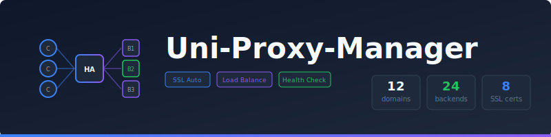

<p align="center">
  
</p>

<p align="center">
  <a href="https://github.com/unified-projects/uni-proxy-manager/releases">
    
  </a>
  <a href="https://github.com/unified-projects/uni-proxy-manager/actions/workflows/test.yml">
    
  </a>
  <a href="https://github.com/unified-projects/uni-proxy-manager/blob/main/LICENSE.md">
    
  </a>
</p>

---

Open-source HAProxy management platform with SSL automation, load balancing, health checks, and custom error pages.

## Setup

```bash
cp .env.example .env
cp docker-compose.example.yml docker-compose.yml
docker compose up -d
```

The dashboard and API are served together via HAProxy at `localhost:3000`. All API requests (`/api/*`) are automatically routed to the backend.

Proxy traffic flows through `localhost:80` (HTTP) and `localhost:443` (HTTPS).

## Configuration

Edit `.env` with your settings:

- `UNI_PROXY_MANAGER_ACME_EMAIL` - Email for Let's Encrypt certificates
- `UNI_PROXY_MANAGER_CLOUDFLARE_API_TOKEN` - Cloudflare API token for DNS challenges
- Database and Redis URLs are preconfigured for Docker

## Development

```bash
pnpm install
pnpm dev
```

## Testing

```bash
pnpm test              # Unit tests
pnpm test:integration  # Integration tests (requires Docker)
pnpm test:e2e          # E2E tests
```

Or run everything:

```bash
bash run-tests.sh
```

## License

[AGPL-3.0](LICENSE.md) - Unified-Projects LTD. 2026